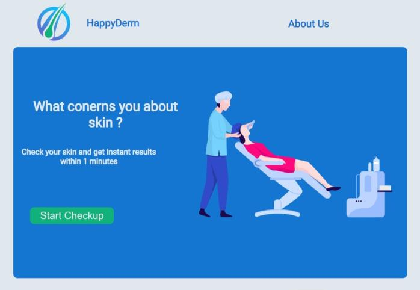
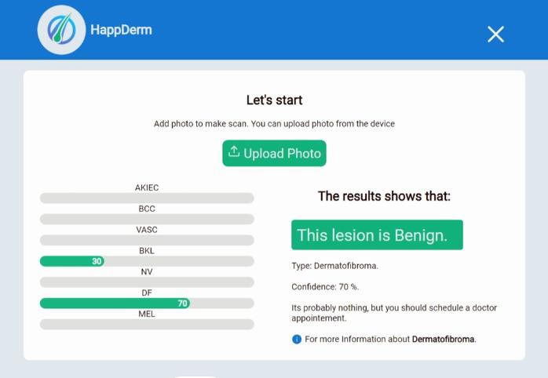
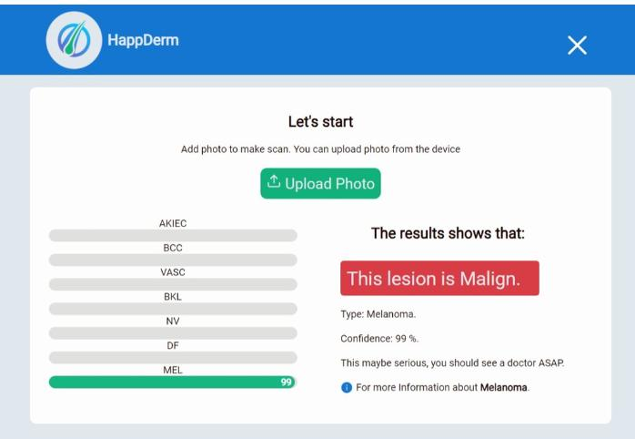

<h1 align="center"> HappyDerm-Website</h1>

This react app is the frontend  part of my PFE, we created skin cancer prediction models with different technologies
and we deployed the more performant.

  

In this project , the image inserted by the user of a skin leasion to a django server, we get JSON response of the predictions resulted.

<h3>In case of a Benign lision:</h3>

  

<h3>In case of a Malign lision:</h3>

  

